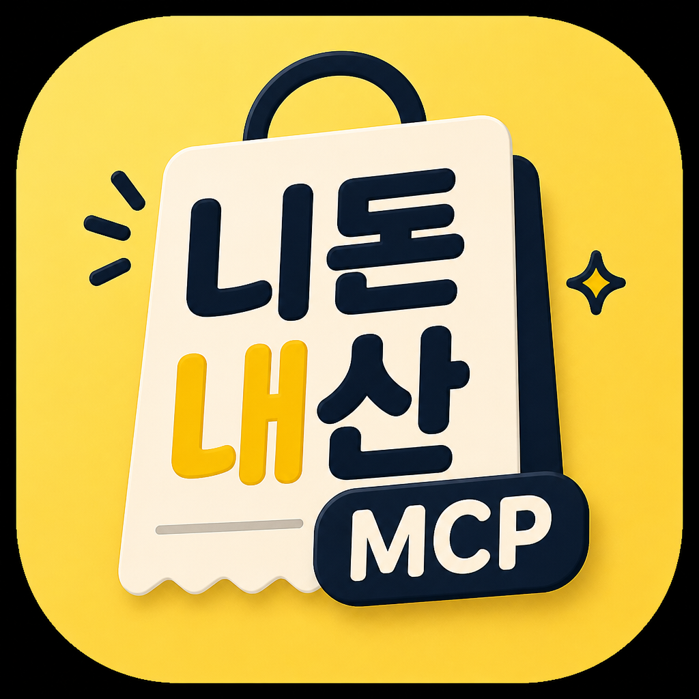
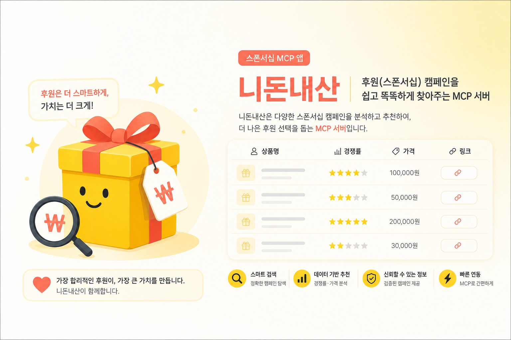

<div align="center">



# 니돈내산

### 협찬 받고, 추천까지 한 번에

[](https://playmcp.kakaocloud.io)
[](https://playmcp.kakaocloud.io)
[](https://github.com/dablro12/nidonnaesan-mcp)
[](https://github.com/dablro12/nidonnaesan-mcp/pkgs/container/nidonnaesan-mcp)
[](https://www.python.org/)
[](https://modelcontextprotocol.io/)

> 카카오톡에서 말하듯이 협찬을 찾고, 비교하고, 신청까지 한 번에.  
> **마케팅 분야 최초의 협찬 MCP** — 블로거 · 인스타 리뷰어 · 협찬 초보자 모두 사용할 수 있습니다.

<br>



</div>

---

## MCP 소개

체험단 플랫폼 API·네이버 쇼핑·블로그 RSS를 연결해 **맞는 협찬을 추천**하고, **시장가·체험가치를 비교**하며, **신청 한마디 초안**까지 도와주는 MCP 서버입니다.

**핵심 기능**
- 🎯 니즈 맞춤 · 오늘 인기 · 마감 임박(D-0/D-1) · 경쟁률 낮은 순 **통합 추천**
- 💰 네이버 쇼핑 **시장가 비교** · 체험가치 · 경쟁률 표
- ✍️ 제품명·캠페인 링크 기반 **신청 한마디 3문장** (블로그 URL 있으면 채널 맞춤)
- 📚 운영자 검증 **협찬 팁 29종** (선정률·플랫폼·광고표기·SEO 등)
- 👤 지역·업종 **프로필 저장** + **적성 테스트**

**실사용 예시**  
카카오톡에서 「서울 맛집 협찬 있어?」, 「마감 임박한 거 알려줘」, 「경쟁 덜한 뷰티 추천해줘」처럼 **한 문장**으로 말하면, AI가 **경쟁률·제품가격·신청 링크**가 담긴 표로 골라 보여줍니다. 여러 체험단 사이트를 돌아다니지 않아도 **탐색·비교·선택**이 한곳에서 됩니다.

---

## 이게 뭐예요?

협찬이 처음이거나, 매번 사이트마다 검색하기 번거로울 때 — **어떤 제품을 신청하고, 가치 있는지, 뭐라고 써야 하는지** 막막하잖아요.

**니돈내산**은 카카오톡 에이전트와 연결하면, 평소 대화하듯 물어보기만 해도 **맞는 협찬 추천**, **가격·경쟁률 비교**, **신청 문구 초안**, **선정 팁**까지 한 번에 받을 수 있습니다.

> 체험단 **신청·리뷰·광고 표기**는 사용자 본인 책임입니다. 신청 문구는 **초안**이며, 본인 채널에 맞게 수정 후 제출하세요.

---

## 이런 때 써보세요

| 상황 | 이렇게 물어보세요 |
|------|-------------------|
| 🌱 **협찬 처음** | 「협찬 처음인데 뭐부터 해?」 |
| 🔥 **오늘 인기** | 「오늘 인기 협찬 5개 보여줘」 |
| 📍 **지역·업종** | 「서울쪽 레스토랑 협찬 추천해줘」 |
| ⏰ **마감 임박** | 「마감 하루 안 남은 협찬 알려줘」 |
| 📉 **경쟁 낮은** | 「뷰티 배송형 중에 여유 있는 거 찾아줘」 |
| 💰 **가격 비교** | 「이 텀블러 살균기 협찬 시장가랑 비교해줘」 |
| ✍️ **신청 문구** | 「텀블러 살균 건조기 신청한마디 작성해줘」 |
| 📈 **선정률 UP** | 「체험단 선정률 올리는 방법 알려줘」 |
| 📝 **블로그 분석** | 「내 블로그 주제 분석해줘」 (네이버 블로그 URL) |

---

## 어떻게 쓰나요?

### 카카오톡 · PlayMCP 사용자

1. PlayMCP에서 **니돈내산** MCP를 연결합니다.
2. 평소 카톡하듯 **지역·업종·조건**을 한 문장으로 보냅니다.
3. 에이전트가 협찬 표·비교·신청 링크·팁을 알려줍니다.

**팁:** 「서울」「강남」「맛집」「뷰티」처럼 **대략적인 조건**만 알려도 됩니다.  
**팁:** 협찬 처음이면 적성 테스트 → 초보 추천(`easy_pick`) 순으로 안내받을 수 있습니다.

### 개발자 · MCP 연결

| 항목 | 값 |
|------|-----|
| **MCP 이름** | 니돈내산 - 협찬 받고, 추천까지 한 번에 |
| **MCP 식별자** | `nidonnaesan` |
| **Endpoint** | `https://nidonnaesan-mcp-server.playmcp-endpoint.kakaocloud.io/mcp` |
| **Endpoint name** | `nidonnaesan-mcp-server` |
| **Docker 이미지** | `ghcr.io/dablro12/nidonnaesan-mcp:latest` |
| **GitHub** | https://github.com/dablro12/nidonnaesan-mcp |

### 한 줄 소개 (KC / 마켓 등록)

```
카카오톡에서 말하듯이 맞는 협찬을 찾아 추천해 주는 협찬 도우미
```

기술 문서 → [docs/DEPLOY_KC.md](docs/DEPLOY_KC.md) · [docs/PLAYMCP_EXAMPLES.md](docs/PLAYMCP_EXAMPLES.md)

---

## 바로 복사해서 써보기

```
협찬 처음인데 뭐부터 해?
```

```
서울쪽 레스토랑 협찬 추천해줘
```

```
뷰티 배송형 협찬 중에 여유 있는 거 찾아줘
```

```
오늘 인기 협찬 5개 보여줘
```

```
텀블러 살균 건조기 신청한마디 작성해줘
```

더 많은 예시 → [카톡 스타일 테스트](docs/PLAYMCP_EXAMPLES.md)

---

## 누구를 위한 서비스인가요?

- 📝 **블로거** — 네이버 블로그 체험단·시장가 비교·신청 문구 초안
- 📸 **인스타 리뷰어** — 배송형·뷰티·맛집 협찬 탐색
- 🌱 **협찬 초보** — 적성 테스트 · 경쟁률 낮은 추천 · 팁 29종
- 🏪 **지역 맛집·숙박** — 서울·강남 등 지역·업종 맞춤 검색
- ⏰ **마감 쫓기** — D-0/D-1 마감 임박 협찬 빠른 확인

---

## Tool 소개 (5가지)

| # | 기능 | 설명 |
|---|------|------|
| 1 | **협찬 추천** | 오늘의 인기 · 니즈 맞춤 · 마감 임박 · 경쟁률 낮은 순 통합 추천 |
| 2 | **가치 판단** | 네이버 쇼핑 시장가 비교 · 체험가치 · 경쟁률 표시 |
| 3 | **신청 지원** | 제품명·캠페인 링크 기반 신청 한마디 3문장 (블로그 URL 선택) |
| 4 | **협찬 노하우** | 검증 팁 **29종** (선정률·플랫폼·광고표기·SEO·리뷰 작성법 등) |
| 5 | **내 정보 저장** | 지역·업종 프로필 + 적성 테스트 |

### MCP Tool 목록 (12개)

| Tool | 역할 |
|------|------|
| `get_campaign_recommendations` | 통합 추천 — easy_pick / by_need / urgent |
| `get_today_hot_campaigns` | 오늘의 인기 협찬 |
| `search_campaigns_by_need` | 자연어 니즈 탐색 |
| `get_urgent_campaigns` | 마감 임박 D-0/D-1 |
| `compare_product_market_price` | 네이버 쇼핑 시장가 비교 |
| `analyze_channel_profile` | 블로그 채널 분석 |
| `generate_application_comment` | 신청 한마디 3문장 |
| `get_campaign_link` | 신청 페이지 링크 |
| `run_sponsorship_aptitude_test` | 협찬 적성 테스트 |
| `get_sponsorship_tips` | 팁 전수 (29개) |
| `set_reviewer_profile` | 프로필 저장 |
| `get_reviewer_profile` | 프로필 조회 |

---

## 프로젝트 구조

```
nidonnaesan-mcp/
├── nidonnaesan_server.py    # MCP 엔트리 (12 tools)
├── assets/                  # app_icon · README 배너
├── src/                     # 도메인 로직
│   ├── campaign_*.py        # API·필터·추천·동기화
│   ├── application_comment.py
│   ├── channel_profile.py
│   └── tool_descriptions.py
├── data/
│   ├── campaigns/           # 캠페인 캐시 (15분 주기 동기화)
│   └── tips/                # 팁 MD 29종
├── scripts/ · tests/ · docs/
```

상세 → [docs/PROJECT_STRUCTURE.md](docs/PROJECT_STRUCTURE.md)

---

## 로컬 실행

```bash
pip install -r requirements.txt
cp .env.example .env
python scripts/sync_campaigns.py   # 최초 1회
python nidonnaesan_server.py
```

- MCP Inspector: `http://localhost:8000/mcp`
- 테스트: `pytest tests/ -q`

---

## 배포

1. `main` push → GitHub Actions → `ghcr.io/dablro12/nidonnaesan-mcp:latest`
2. PlayMCP KC → 이미지 `latest` 재배포
3. **정보 불러오기** → Tool 12개 · description 확인

→ [docs/DEPLOY_KC.md](docs/DEPLOY_KC.md)

---

## 데이터 소스

| 구분 | 소스 | 용도 |
|------|------|------|
| 캠페인 | 체험단 API | 목록·상세·신청링크 (15분 주기 동기화) |
| 시장가 | 네이버 쇼핑 API | 가격 비교 |
| 채널 | 네이버 블로그 RSS | 신청 문구 맞춤 (선택) |
| 팁 | `data/tips/` | 29종 정적 MD |
| 프로필 | SQLite | 필터·적성 |

---

## 더 보기

| 문서 | 내용 |
|------|------|
| [기능설명서](docs/기능설명서.md) | 서비스·기능 상세 |
| [submit_form/nidonnaesan-submit.md](docs/submit_form/nidonnaesan-submit.md) | PlayMCP·AGENTIC 제출 |
| [PLAYMCP_EXAMPLES.md](docs/PLAYMCP_EXAMPLES.md) | 카톡 스타일 예시 |
| [MCP_CLIENT_ROUTING.md](docs/MCP_CLIENT_ROUTING.md) | 에이전트 라우팅 |
| [DEPLOY_KC.md](docs/DEPLOY_KC.md) | KC/GHCR 배포 |

---

<div align="center">

**카카오 2026 AGENTIC PLAYER 10 · 예선 제출**

니돈내산 — 협찬 받고, 추천까지 한 번에

</div>
