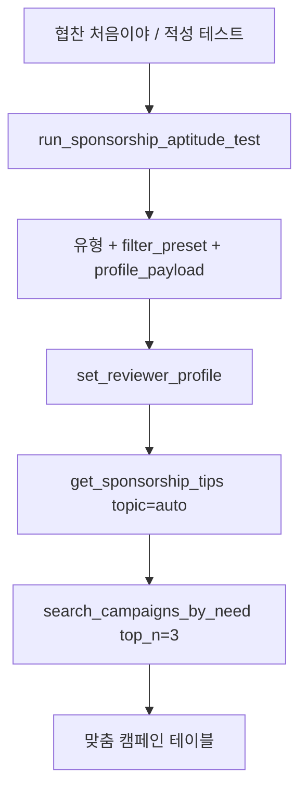

# 니돈내산 - 협찬 받고, 신청까지 한 번에

## 1. 제품 개요

`니돈내산(nidonnaesan)`은 체험단/협찬 캠페인 데이터를 수집하고, 리뷰어 채널(블로그/인스타)에 맞는 캠페인을 추천하며, 신청 문구 생성과 협찬 노하우 전수까지 제공하는 MCP 서버입니다.

핵심 가치:
- 흩어진 캠페인 탐색 시간을 줄인다.
- 체험가치·경쟁률·시장가로 "이 협찬 가치 있나?"를 판단한다.
- 신청 한마디를 즉시 제출 가능한 수준으로 생성한다.
- 초보자에게 적성 테스트와 검증된 팁을 전수한다.

## 2. 문제 정의

1. 여러 체험단 플랫폼을 매일 직접 순회해야 한다.
2. 어떤 캠페인이 내 채널과 맞는지 판단이 어렵다.
3. 신청 한마디를 매번 새로 작성해야 한다.
4. 선정률을 올리는 방법을 체계적으로 배우기 어렵다.

## 3. 타겟 사용자

1. 블로거 리뷰어
2. 인스타 리뷰어
3. 초기 시작자(입문 리뷰어)

## 4. 핵심 메시지

**니돈내산 - 협찬 받고, 신청까지 한 번에**

## 5. MVP 범위

상세: [MVP_SCOPE.md](./MVP_SCOPE.md)

### 5.1 필수 기능

1. 오늘의 인기 협찬 5개 (테이블)
2. 니즈 기반 캠페인 탐색 (자연어 → 3~5개 비교)
3. 체험가치 판단 (매체별 기준단가 대비)
4. 네이버 쇼핑 시장가 비교
5. 채널 분석 + 신청 한마디 3문장 생성
6. 협찬 적성 테스트 (5~7문항, 1회성)
7. 협찬 팁 전수 (5토픽 + 프로필 맞춤)
8. 프로필 저장/조회 (`set_reviewer_profile` / `get_reviewer_profile`)

### 5.2 제외 (MVP)

- Notion 저장
- 대회 발표용 DEMO_SCRIPT/KPI 문서
- 세션 기반 메모리 (`start_session`)

## 6. MCP 도구 (10개)

| # | 툴 | 역할 |
|---|-----|------|
| 1 | `get_today_hot_campaigns` | 인기 협찬 |
| 2 | `search_campaigns_by_need` | 니즈 탐색 |
| 3 | `compare_product_market_price` | 시장가 비교 |
| 4 | `analyze_channel_profile` | 채널 분석 |
| 5 | `generate_application_comment` | 신청 한마디 |
| 6 | `get_campaign_link` | 신청 링크 |
| 7 | `run_sponsorship_aptitude_test` | 적성 테스트 |
| 8 | `get_sponsorship_tips` | 팁 전수 |
| 9 | `set_reviewer_profile` | 프로필 저장 |
| 10 | `get_reviewer_profile` | 프로필 조회 |

상세 스펙: [TOOL_SPEC.md](./TOOL_SPEC.md)

## 7. 협찬 적성 테스트 온보딩 플로우

- 적성 유형 5종: 맛집 탐험가, 뷰티 크리에이터, 생활 기록자, 여행러, 올라운더
- 상세: [APTITUDE_TEST.md](./APTITUDE_TEST.md)

## 8. 메모리 전략 (카카오 MCP 대회 기준)

- **Stateless 서버**: HTTP 세션 없음 (`start_session` 금지)
- **프로필 영속 저장**: 지원금봇 `set_profile` 패턴 채택
- **저장 키**: OAuth `sub` (Phase 2) / `profile` 파라미터 fallback (Phase 1)
- **저장소**: SQLite (MVP) → Redis (배포)

상세: [PROFILE_MEMORY.md](./PROFILE_MEMORY.md)

## 9. 팁 전수 체계

운영자 100건+ 직접 신청 경험 기반 5토픽:

| topic | 내용 |
|-------|------|
| `selection_rate` | 선정률 높이는 방법 7가지 |
| `blog_index` | 블로그 지수·C-Rank |
| `platform` | 플랫폼 9개 비교 |
| `ad_disclosure` | 광고 표기법 |
| `posting_omission` | 포스팅 누락 예방 |

데이터: [data/tips/](../../data/tips/)

## 10. 체험가치·경쟁률

- 체험가치: 매체별 기준단가 대비 (블로그 3만, 릴스 5만) → 높음/보통/낮음
- 경쟁률: `applicants/recruitCount` (X.X:1) + 여유/보통/치열 라벨
- 100점 합격점수는 사용하지 않음

## 11. 카카오톡 사용자 시나리오

1. "협찬 처음인데 뭐부터?" → 적성 테스트 → 맞춤 팁 → 추천 캠페인 3개
2. "오늘 인기 협찬 5개" → 테이블 + 체험가치 + 신청 링크
3. "아이 튜브 협찬 찾아줘" → 니즈 탐색 테이블
4. "선정률 올리는 법" → 팁 전수 → 신청 한마디 생성
5. "이 캠페인 신청 문구 써줘" → 채널 분석 + 3문장

## 12. 기술 및 연동

- 체험단 API: `https://api-on7fpupona-du.a.run.app/campaigns`
- 네이버 쇼핑 Search API
- 네이버 블로그 (채널 분석)
- Skills: `reviewer-application-comment-ko`

## 13. 리스크 및 대응

| 리스크 | 대응 |
|--------|------|
| API 변경 | 필드 매핑 레이어 분리 |
| 팁 정적 데이터 노후화 | `data/tips/` 버전 관리 |
| OAuth 미연동 시 프로필 소실 | `profile` 파라미터 fallback |

## 14. 출시 단계

| 단계 | 범위 |
|------|------|
| 1차 (현재) | 기획 문서 + Tool 스펙 + tips 데이터 |
| 2차 | MCP 서버 구현, 캠페인 API 연동 |
| 3차 | OAuth + SQLite 프로필, PlayMCP 심사 |
